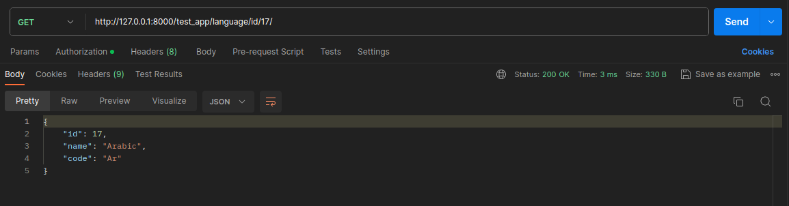
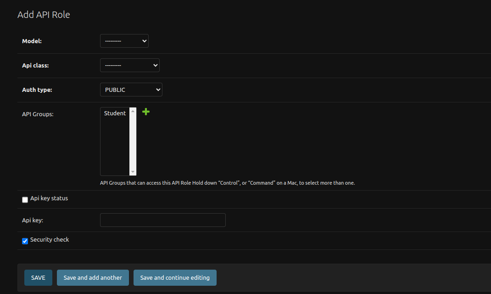
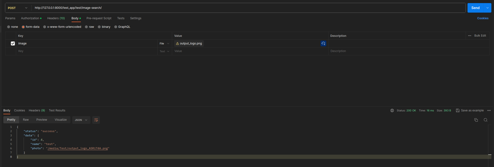

# Django KHAPI

Khapi is a powerful Django app that simplifies the process of creating APIs for your Django web app. It utilizes a Reverse Hash Table to optimize data retrieval and provides easy-to-use API classes for various operations.

## Features

- **Reverse Hash Table:** Efficiently stores and retrieves data from your Django models.
- **Simple API Creation:** Create APIs with minimal code using predefined classes.
- **Built-in API Classes:** Includes ListAPI, ListByValueAPI, GetByIdAPI, SearchAPI, CreateAPI, UpdateAPI, and ImageSearchAPI.
- **Image Search:** Utilize AI-based image search functionality.
- **API Security Settings:** Django admin integration for managing API authorization settings.

## Getting Started

### Installation

Install khapi using pip:

```bash
pip install khapi
```
In your Django project's settings.py, add the following configurations:
```python
INSTALLED_APPS = [
    "khapi",
    "khapi.auth_system",
    # ... other apps ...
]
#For your User model
AUTH_USER_MODEL = "your_app.CustomUser"

KHAPI = {
    "CACHE_APPS": [
        "your_apps",
    ],
}

```
Now, go to any app file, specifically urls.py, and add the following to initialize khapi:
```python
from khapi.khapi_start import khapi_cache_start
khapi_cache_start()
```

After making these changes, run the following command:
 
```bash
python manage.py khapi
```
*After any use of python manage.py makemigrations, you need to run python manage.py khapi to create a cache dict for your models.


### Example

To create an API endpoint that returns a list of all your model data by field value:

```python
# app/views.py
from .models import Language
from khapi.views import (
    ListByValueAPI,
)
class LanguageListByValueAPI(ListByValueAPI):
    model = Language


# app/urls.py
from khapi.khapi_start import khapi_cache_start
from . import views
from django.urls import path

khapi_cache_start()

urlpatterns = [
    path(
        "language/value/<str:value>/",
        views.LanguageListByValueAPI.as_api(),
        name="languagebyvalue-view",
    ),
]

# project/urls.py
from django.urls import include, path
urlpatterns = [
    path('admin/', admin.site.urls),
    path("your_app/", include("your_app.urls")),
]

```
# Fastest GET Response Ever


# API Admin 


# Built-in API Classes

KhAPI comes with several built-in API classes that make it easy to create APIs for your Django models. Below is a brief overview of each class:
## ListAPI

- **Description:** Returns all data from the model as a list.
- **Usage:**
  ```python
  from khapi.views import ListAPI
  class YourListAPI(ListAPI):
      model = YourModel

  ```
  
## ListByValueAPI

- **Description:** Returns data from the model based on a specified field value.
- **Usage:**
  ```python
  from khapi.views import ListByValueAPI
  class YourListByValueAPI(ListByValueAPI):
      model = YourModel

  ```

## GetByIdAPI

- **Description:** Returns data from the model based on the specified ID.
- **Usage:**
  ```python
  from khapi.views import GetByIdAPI
  class YourGetByIdAPI(GetByIdAPI):
      model = YourModel

  ```

## SearchAPI

- **Description:** Searches for data in the model based on specified values.
- **Usage:**
  ```python
  from khapi.views import SearchAPI
  class YourSearchAPI(SearchAPI):
      model = YourModel

  ```

## CreateAPI

- **Description:** Creates new entries in the model.
- **Usage:**
  ```python
  from khapi.views import CreateAPI
  class YourCreateAPI(CreateAPI):
      model = YourModel

  ```

## UpdateAPI

- **Description:** Updates existing entries in the model.
- **Usage:**
  ```python
  from khapi.views import UpdateAPI
  class YourUpdateAPI(UpdateAPI):
      model = YourModel

  ```

## ImageSearchAPI

vist [khapitools](https://github.com/khfix/khapitools) to installation.
- **Description:** Utilizes AI-based image search functionality.
- **Usage:**
  ```python
  from khapitools.views import ImageSearchAPI
  from .models import YourModel
  class YourImageSearchAPI(ImageSearchAPI):
      model = YourModel
  
  ```



### License

This project is licensed under the MIT License.

### Support

For questions or issues, please open an issue or contact us at [hamza.alkhatib.se@gmail.com](mailto:hamza.alkhatib.se@gmail.com)


### Acknowledgments
Thanks to the Django community.


